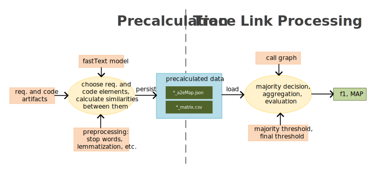

# Fine-grained Traceability Link Recovery (FTLR)
| :exclamation:  Please Note:                                                                                                                                                                                                                                                                                                                                         |
|---------------------------------------------------------------------------------------------------------------------------------------------------------------------------------------------------------------------------------------------------------------------------------------------------------------------------------------------------------------------|
| If you are searching for the version of FTLR used in the publication **Improving Traceability Link Recovery Using Fine-grained Requirements-to-Code Relations** check out [ICSME'21 Artifact Track Submission](https://github.com/tobhey/finegrained-traceability/releases/tag/v1) release or [v1](https://github.com/tobhey/finegrained-traceability/tree/v1) tag. |

This repository contains the code of the requirements-to-code traceability link recovery tool FTLR.
It extends the code provided with the ICSME'21 publication [**Improving Traceability Link Recovery Using Fine-grained Requirements-to-Code Relations**](https://doi.org/10.1109/ICSME52107.2021.00008).

## Setup

See [INSTALL](./INSTALL.md) for the local installation.

## Process

Since instantiating the fastText model and the spacy lemmatizer is expensive, the trace link recovery process is split into two phases: precalculation and trace link processing.
The following image shows a simplified architecture of the process.

### Precalculation phase
The precalculation phase consists of the following steps:
1. Choose which elements of the requirement artifacts and code artifacts are used to calculate the similarity ([Tokenizers](preprocessing/Tokenizer.py), [WordChoosers](embeddingCreator/WordChooser.py))
2. Calculate the similarity between all possible combinations of the chosen requirement and code artifacts
3. Save the resulting similarity matrix in a `*_matrix.csv` and the mapping between requirement/code artifacts to their containing elements in an artifact to element map (`*_a2eMap.json`)

### Trace Link Processing phase

This phase consists of the following activities:

1. Load the precalculated files
2. If enabled and call graph exists, incorporate call dependencies into similarity values
3. If enabled, filter requirement elements based on requirements classification  
4. Apply majority decision threshold 
5. Do the majority decision
6. Derive/aggregate artifact level trace links
7. Apply final similarity threshold filter
8. Output resulting trace links
9. Do the evaluation: calculate F1 or Mean Average Precision (MAP)

There is a corresponding [TraceabilityRunner](./TraceabilityRunner.py) for each configuration which automatically does the setup. You only have to instantiate a `TraceabilityRunner` and call `precalculate`, `output_trace_links` or `calculate_f1_and_map`.

**Note 1:** Both the `output_trace_links` and `calculate_f1_and_map` have the optional parameters `matrix_file_path` and `artifact_map_file_path` to locate the precalculated files. The default value is `None` which means that the precalculated files are loaded from their default locations.

### Runners
There are six different types of runners:
* `FTLRRunner`: The actual FTLR approach
* `ElementAvgCosineRunner`: An approach using the same fine-grained approach as FTLR but use the average cosine distance between two elements instead of the word movers distance
* `ArtifactAvgCosineRunner`: Also uses average cosine distance but maps on the artifact level (requirement files to code files)
* `ArtifactWMDRunner`: Also maps on the artifact level but uses word movers distance (WMD) instead
* `UniXcoderWMDRunner`: Uses a pretrained UniXcoder model instead of fastText and uses WMD. Also fine-grained
* `UniXcoderRunner`: Uses a pretrained UniXcoder model instead of fastText and uses cosine distance on the aggregated first token. Also fine-grained.

Additionally, different variants can be run by choosing a runner class containing a certain keyword:
* `UCT`: for datasets that contain use case descriptions as requirements following a template, certain fields like actor, pre- and postconditions are filtered
* `MC`: if method comments are available they are integrated into the representation of a code element
* `CD`: uses call dependencies to enhance the similarity calculation of a source code element

For example, the `FTLRUCTCDRunner` sets up FTLR using use case template filters and call dependencies.

**Note 1:** Itrust doesn't use use case templates and LibEST has no call graph model files. Therefore, running Itrust with any `*UCT*Runner` and Libest with any `*CDRunner`  will not work.

**Note 2:** As depicted in the simplified architecture diagram above, the inclusion of the call graph happens *after* the precalculation. Therefore, the corresponding configurations with and without the call graph use the same precalculated files. For example, `FTLRUCTMCCDRunner` uses the same precalculated files as `FTLRUCTMCRunner`.

**Note 3:** All english and italian spacy word lemmas are precalculated, too. The files are in [preprocessing/resources](./preprocessing/resources). The files are simple csv files with all words of all datasets and their corresponding lemmas. We're using precalculated lemma files to reduce memory consumption. To re-precalculate the lemmas, see [Lemmatizer class](./preprocessing/Preprocessor.py).

### Element Filters
Additionally a Runner can be configured to use precalculated requirements elements classification results to filter elements.
Therefore set the parameter `element_filter`to one of the [ElementFilter](traceLinkProcessing/ElementFilter.py) subclasses:
* `NFRElementFilter`: Filters elements that were classified as not comprising functional aspects (`F = 0`)
* `UserRelatedElementFilter`: Filters elements that were classified as describing user related information (`UR = 1`)
* `UserRelatedNFRElementFilter`: Combines both filters

The precalculated classification files can be found in the corresponding datasets folders.
There are two versions: `*_gold.csv` is the gold standard classification from https://doi.org/10.5281/zenodo.7867845 and `*_best.csv` the result of an automatic classification by [NoRBERT for TLR](https://doi.org/10.5281/zenodo.8348363)

**Note:** By default the automatic classification is used. To change to the gold standard you must initialize the respective Dataset class with a different `classification_file`.  

## Running the code
There are three ways to run the code: Write your own script like the one in [App.py](App.py), running the evaluation in parallel with scripts in [scripts folder](evaluation/scripts) and using the [CLI](FTLR.py).
In each case the result files are saved in the corresponding `datasets/[DATASETNAME]/output` folder. 
### CLI
[FTLR.py](./FTLR.py) provides a CLI for using the tool. It can be defined with the following options:

~~~
usage: FTLR [-h] --dataset {etour,itrust,itrustjsp,smos,eanci,smostrans,eancitrans,libest,albergate}
            [--variant {ftlr,ecoss,acoss,awmd,uxccos,uxcwmd}] [--use_case_templates] [--method_comments]
            [--call_dependencies] [--nqk] [--metric {f1,map,both,None}] [--processing_step {precalculate,run,both}]
            [--filter {NF,NB,both,None}] [--gold_standard] [--majority_threshold MAJORITY_THRESHOLD]
            [--final_threshold FINAL_THRESHOLD] [--english_model ENGLISH_MODEL] [--italian_model ITALIAN_MODEL]
            [--unixcoder_model UNIXCODER_MODEL] [--optimize_thresholds]

Performs Evaluation of FTLR-Variants on Different Datasets.

options:
  -h, --help            show this help message and exit
  --dataset {etour,itrust,itrustjsp,smos,eanci,smostrans,eancitrans,libest,albergate}, -d {etour,itrust,itrustjsp,smos,eanci,smostrans,eancitrans,libest,albergate}
                        Choose dataset to run on
  --variant {ftlr,ecoss,acoss,awmd,uxccos,uxcwmd}, -v {ftlr,ecoss,acoss,awmd,uxccos,uxcwmd}
                        Choose tlr variant (default: ftlr)
  --use_case_templates, -uct
                        Use use case template filter
  --method_comments, -mc
                        Use method comments in representation
  --call_dependencies, -cd
                        Use call dependencies
  --nqk, -nqk           Use reduced preprocessing (only remove links, numbers and special characters)
  --metric {f1,map,both,None}, -m {f1,map,both,None}
                        Choose metric to calculate (default: None)
  --processing_step {precalculate,run,both}, -p {precalculate,run,both}
                        Either precalculate, run or both (default: both)
  --filter {NF,NB,both,None}, -f {NF,NB,both,None}
                        Either NF, NB, both or None (default: None)
  --gold_standard, -g   Use gold standard requirements classification results
  --majority_threshold MAJORITY_THRESHOLD, -mt MAJORITY_THRESHOLD
                        Define the majority threshold (default: 0.59)
  --final_threshold FINAL_THRESHOLD, -ft FINAL_THRESHOLD
                        Define the final threshold (default: 0.44)
  --english_model ENGLISH_MODEL, -em ENGLISH_MODEL
                        Path to english fasttext model file (default: ../models/cc.en.300.bin)
  --italian_model ITALIAN_MODEL, -im ITALIAN_MODEL
                        Path to italian fasttext model file (default: ../models/cc.it.300.bin)
  --unixcoder_model UNIXCODER_MODEL, -uxcm UNIXCODER_MODEL
                        Path to unixcoder model files (default: ../models/unixcoder-base)
  --optimize_thresholds, -OPT
                        Optimizes thresholds by varying in 0.01 steps from 0 to 1 (does not output trace links)
~~~

## Datasets

This repository contains nine datasets:

<table style="border-collapse: collapse; margin-left:15px; ">
    <tr style="border-bottom: 1px solid grey">
        <th style="padding-right:15px">dataset</th><th style="padding-right:15px">dataset class name</th><th style="padding-right:15px">language</th><th>requirements classification file exists</th>
    </tr>
    <tr><td>eTour</td><td>Etour</td><td>english</td><td>&check;</td></tr>
    <tr><td>iTrust (w/o JSP)</td><td>Itrust</td><td>english</td><td>&check;</td></tr>
    <tr><td>iTrust (incl. JSP)</td><td>ItrustFull</td><td>english</td><td>&check;</td></tr>
    <tr><td>SMOS</td><td>Smos</td><td>italian</td><td>&check;</td></tr>
    <tr><td>SMOS (translated)</td><td>SmosTrans</td><td>english</td><td>&check;</td></tr>
    <tr><td>eAnci</td><td>Eanci</td><td>italian</td><td>&check;</td></tr>
    <tr><td>eAnci (translated)</td><td>EanciTrans</td><td>english</td><td>&check;</td></tr>
    <tr><td>LibEST</td><td>Libest</td><td>english</td><td>&check;</td></tr>
    <tr><td>Albergate</td><td>Albergate</td><td>italian</td><td>&cross;</td></tr>
</table>

**Note:** The SMOS and eTour dataset comprised code identifier in a different than the prevalent language.
To fully enable the potential of a word embedding based approach we translated the identifiers in the two datasets (SMOS and eTour) to match the prevalent language.
As SMOS and eAnci's original requirements are written in Italian, the repository also comprises automatically translated versions of the projects to English.
All datasets have a gold standard with solution trace links created by their original authors.

The datasets can be found in the [datasets](./datasets/) folder.

### Attribution (of datasets used):

The original SMOS and eAnci dataset can be attributed to Gethers et al., On integrating orthogonal information retrieval methods to improve traceability recovery. In 2011 27th IEEE International Conference on Software Maintenance (ICSM), Sep. 2011. Available: https://doi.org/10.1109/ICSM.2011.6080780

The original eTour dataset was provided for the TEFSE challenge at 6th International Workshop on Traceability in Emerging Forms of Software Engineering (TEFSE), 2011 and was retrieved from http://coest.org/

The iTrust dataset was retrieved from http://coest.org/

The LibEST dataset can be attributed to Moran et al., Improving the Effectiveness of Traceability Link Recovery using Hierarchical Bayesian Networks. In 2020 IEEE/ACM 42nd International Conference on Software Engineering (ICSE), May 2020 and was retrieved from https://gitlab.com/SEMERU-Code-Public/Data/icse20-comet-data-replication-package

The Albergate dataset can be attributed to Antoniol et al.,	Recovering traceability links between code and documentation. In 	IEEE Trans. on Software Eng., 28(10):970–983, 2002 and was retrieved from http://coest.org/
